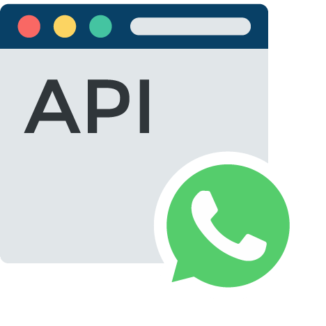

<p align="center">
  <a href="https://github.com/BlakePro/WhatsAppApiNodeJS">
    
  </a>
  <h1 align="center">Unofficial API for WhatsApp</h1>
  <h3 align="center">(Bot / Webhook / Socket)</h3>
</p>

## Table of Contents

* **[Install & Start](#start)**
  - [Install Dependencies](#dependencies)
  - [Run Webservice](#run)
  - [Run Webservice (background mode)](#runbackground)
* **[Install from scratch](#scratch)**
  - [Install Git](#git)
  - [Install Node](#node)
  - [Install Utilities from Puppeteer](#utilities)
  - [Clone GitHub Repo](#clone)
* **[Api](#api)**
  - [Endpoints](#endpoints)
  - [Examples (CURL)](#apiexamples)
* **[Bot](#bot)**

<a name="start"></a>
## Install & Start

<a name="dependencies"></a>
**Install Dependencies**
```sh
sudo npm i
```

**Run WebService**
```sh
npm test port=8333 headless=false debug=true message=true user=user pass=pass
```

**Run WebService (background mode)**
```sh
npm start port=8333 headless=true debug=false message=true user=user pass=pass &
```

**Stop WebService (background mode)**
```sh
ps aux | grep indexWhatsApp.js
kill -9 PID_NUMBER
```

<a name="scratch"></a>
## Install from scratch

<a name="git"></a>
**1. Install Git**
```sh
sudo apt-get install git
```

<a name="node"></a>
**2. Install Node**
[https://github.com/nodesource/distributions] (Node Distribution)
```sh
curl -sL https://deb.nodesource.com/setup_current.x | sudo -E bash -
sudo apt-get install -y nodejs
```

<a name="utilities"></a>
**3. Install Utilities from Puppeteer**
```sh
sudo apt-get install gconf-service libasound2 libatk1.0-0 libatk-bridge2.0-0 libc6 libcairo2 libcups2 libdbus-1-3 libexpat1 libfontconfig1 libgcc1 libgconf-2-4 libgdk-pixbuf2.0-0 libglib2.0-0 libgtk-3-0 libnspr4 libpango-1.0-0 libpangocairo-1.0-0 libstdc++6 libx11-6 libx11-xcb1 libxcb1 libxcomposite1 libxcursor1 libxdamage1 libxext6 libxfixes3 libxi6 libxrandr2 libxrender1 libxss1 libxtst6 ca-certificates fonts-liberation libappindicator1 libnss3 lsb-release xdg-utils wget
```

**3.1 Linux Server**
```sh
sudo apt-get install chromium-browser
```

<a name="clone"></a>
**4. Clone GitHub Repo**
```sh
git clone https://github.com/BlakePro/WhatsAppWebApiNodeJS.git
```

**NOTE:** I can't guarantee you will not be blocked by using this method, although it has worked for me. WhatsApp does not allow bots or unofficial clients on their platform, so this shouldn't be considered totally safe.

<a name="api"></a>
## Api
<a name="endpoints"></a>
| Endpoint        | Post           |
| -------------   | -------------  |
| start           | bot: url <br>  webhook: url  |
| template         | `null`  |
| contact         | number: string |
| picture           | number: string |
| seen            | number: string **(required)** |
| message         | number: string / list <br> message: string / list |
| media           | number: string **(required)** <br> option: json **(required)** <br><br><br> **Option -  File**<br>```{"caption": "", "attachment": "(base64)"``` <br> **Option - Link Preview**<br>```{"content": "(url + string)", "preview": "true"``` |
| download        | option: json **(required)** <br> ```{"clientUrl": "", "mimetype": "", "mediaKey": "", "type": ""}```  |
| chat            | `null`           |
| unread          | `null`           |
| stats           | `null`           |
| state           | `null`           |
| me              | `null`           |
| logout          | `null`           |
| storage         | `null`          |

## Examples (CURL)
<a name="apiexamples"></a>

**Start**
```sh
curl -X POST \
  http://localhost:8333/api/mytoken/start \
  -H 'content-type: application/x-www-form-urlencoded' \
  -d 'bot=http://localhost:8334/exampleBot.php&webhook=null&socket=null'
```

**Send Message**
```sh
curl -X POST \
  http://localhost:8333/api/mytoken/messsage \
  -H 'content-type: application/x-www-form-urlencoded' \
  -d 'number=5215512344567&message=HelloWorld'
```

**Send Media**
```sh
curl -X POST \
  http://localhost:8333/api/mytoken/media \
  -H 'content-type: application/x-www-form-urlencoded' \
  -d 'number=5215512345678&option='{"caption":"HelloFile","attachment":"data:image/svg+xml;base64,PHN2ZyB4bWxucz0iaHR0cDovL3d3dy53My5vcmcvMjAwMC9zdmciIHdpZHRoPSIyNCIgaGVpZ2h0PSIyNCIgdmlld0JveD0iMCAwIDI0IDI0IiBmaWxsPSJub25lIiBzdHJva2U9ImN1cnJlbnRDb2xvciIgc3Ryb2tlLXdpZHRoPSIyIiBzdHJva2UtbGluZWNhcD0icm91bmQiIHN0cm9rZS1saW5lam9pbj0icm91bmQiIGNsYXNzPSJmZWF0aGVyIGZlYXRoZXItY2lyY2xlIj48Y2lyY2xlIGN4PSIxMiIgY3k9IjEyIiByPSIxMCI+PC9jaXJjbGU+PC9zdmc+"}''
```

<a name="bot"></a>
## Bot (php)
- **Start Server PHP**
```sh
  php -l 0.0.0.0:8334
```
- **Set bot URL in start API**
```
  http://localhost:8334/exampleBot.php
```

## Disclaimer

This project is not affiliated, associated, authorized, endorsed by, or in any way officially connected with WhatsApp or any of its subsidiaries or its affiliates. The official WhatsApp website can be found at https://whatsapp.com "WhatsApp" as well as related names, marks, emblems and images are registered trademarks of their respective owners.
